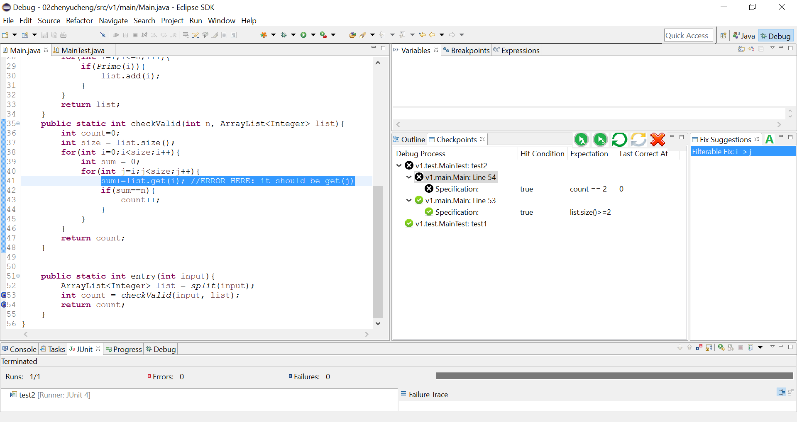

# SmartDebug: An Interactive Java Debug Assistant

## Introduction

SmartDebug is an interactive Java debug assistant. Similar to existing patch generation systems, it analyzes the execution status of tests in a certain test suite, and produces suggestions to fix the bug in a program. However, more than existing systems, it utilizes programmers' judgement of program running state by taking in specifications on "Checkpoints", makes it possible that complicated debug tasks are split into small fragment of tasks. Therefore it is able to work with bugs that can only be fixed with modifications on several locations. SmartDebug works as an eclipse plug-in. Here is a snapshot:

### Repository

SmartDebug is open source in [here](https://github.com/flowersbeyond/SmartDebug).

## Background and Our Contributions

Automated debugging has long been an important research direction. Recently a series of work on "generate-and-validate" (GAV) systems have been developed aiming at "automatically generating patches so that a test suite can be passed". These systems, chronolically, include GenProg, Par, SemFix, DirectFix, SPR, Prophet, etc.

The basic idea of GAV systems is to search through "a pre-defined modification search space" and see if it is possible to somehow modify the source code so that the program passes the test suite. For example, a modification space may include "change every int typed expression 'a' to 'a+1'".

A highlighted advantage of GAV systems is that they fix general bugs, in other words, they do not limit themselves to a narrow range of bugs. Therefore you do not need to analyze the reason of a certain bug manually before you use GAV systems. However, GAV systems are still far from practical usage as the success rate and efficiency cannot be achieved simutaneously. Existing systems are generally slow. It is difficult for these systems to identify the root cause of, or "localize", a bug. Widely adopted localization algorithms often generate a "rank" of expressions or statements that are possibly responsible for the bug. However these ranks are based on empirical metrics and can be imprecise. Even if we are correct at identifying the buggy expressions or statements, there are still infinite ways to modify the source code. How could we possibly know which one is correct? Honestly we cannot. This is why we have a "pre-defined modification search space". We try to modify the source code in ways defined in the search space (the "generate" phase), rerun the test suite and see if the program is fixed (the "validate" phase). As you can see, the success rate is completely decided by the volume of the search space. With bigger search spaces, i.e. larger quantities of modification varieties, it is more likely that we "cover" the correct fix. However, enlarging the search space would incur dramatic efficency loss since, for each possible place we can fix, we need to generate more candidate of fixes, and hence validate more candidate fixes. Even in state of the art system "SPR", experiments show that to achieve a relatively acceptable fix rate, it may take hours to fix a single bug in real world programs.

The goal of our work is to bridge the gap between automated debugging techniques and practical usage. We notice that two major factors that influence the efficiency. First is the "localization accuracy", i.e. the accuracy of the "rank" generated by existing fault localization metrics. Second is the "validation" process, which takes up at least 90% of the time. Correspondingly, we propose two techniques to improve the efficiency.

The first one is a usage design called "interactive debugging", which allows the users to decompose the debug task into small fractions through annotations on program execution state, so that the GAV system can work on small tasks susccessively. This mechanism makes it possible to utilize users' understanding of the faulty program and simplifies debugging task given to GAV systems, which further shortens the waiting time of users when they use the system. This mechanism has already been implemented as an eclipse plugin called SmartDebug.

The second is an optimization technique, called "early filtration", which filters out impossible fix candidates before they ever go into the valdiation phase. Preliminary experiments show that this technique is able to compress the search space dramatically, even harsher than SPR.

## An Interactive Debugger

Please refer to:
 - Xinrui Guo, "SmartDebug: An Interactive Debug Assistant for Java", FSE-SRC 2016 [[pdf]](http://sts.thss.tsinghua.edu.cn/tsmart2.0/da/smartdebug/fse16src-srcid27-preprint.pdf)

## Shorten fix validation process via "early filtration"
The huge search space has always been an obstacle in developing efficient generate-and-validate systems. SPR and Prophet stand out in recent published systems as they first try to prune the search space dramatically and later prioritize possible fix candidates according to a "possibility" computed by learned weighting functions.
Despite the promising results reported, in our experiment, we discovered that the search space can be further pruned through an "early filtration" strategy.

### What is "early filtration"?
"Early filtration", by the name, means to filter impossible fix candidates early in the generate phase, so that they do not flow to the validate phase. It focuses on fixes that only modifies expressions, or fixes that contain modifications of expressions. This strategy is based on the following observation:

  - If an expression A is to be replaced with an expression B, then:
    - In order to ensure that all the passed tests remains passed, A should be "equal" to B at each time the program runs to A's place.
    - In order to correct the failed tests, A should NOT be "equal" to B in at least one time the program runs to B's place.

This is straight forward since the execution process of the passed test cases should not be altered as we modify A to B, while the execution process of the failed test cases MUST be altered.

Based on this observation, for most of the expression fixes covered in state-of-the-art search space, we only need to evaluate the candidate expressions (Bs) and the target expression (A) and see if they obey the observation above. If not, the candidate expression should be tossed out of the candidate list. The following table lists our current search space:

We are currently working on Java programs. The machanism of JVM makes it very convenient to "halt" the execution process at a certain point and evaluate the value of an expression. During our experiment, we discovered that it takes often seconds to validate a fix (think about the modify-and-rebuild process) while only a few milisecond to evaluate an expression on a hot java stackframe. Therefore, through early filtration, we can save a large amount of time since mass majority of the candidates can be filtered out before moving to the validation process.

### Experimental Results

Currently we are performing experiments on Defects4J, a collection of several hundred versions of 5 real world programs. Theoretically our search space covers 30 of the 324 versions. However due to implementation issues, we are now able to fix 24 versions. This is currently the largest amout ever reported on this benchmark. The following table lists the detailed fix status of each bug and the failing reasons.

To investigate the efficiency of early filtration, we analyzed the amount of different kinds of fixes generated during the fix generation process before and after filtration. Here is a data report table:

As shown in the table, HUGE amount of fixes are filtered out before entering into validation phase. For example, in closure-compiler-1, we needed to validate 154963 expression fixes or condition fixes without filtration. However, this number drops to 1878 after early filtration, only 1.21% of the original amount.